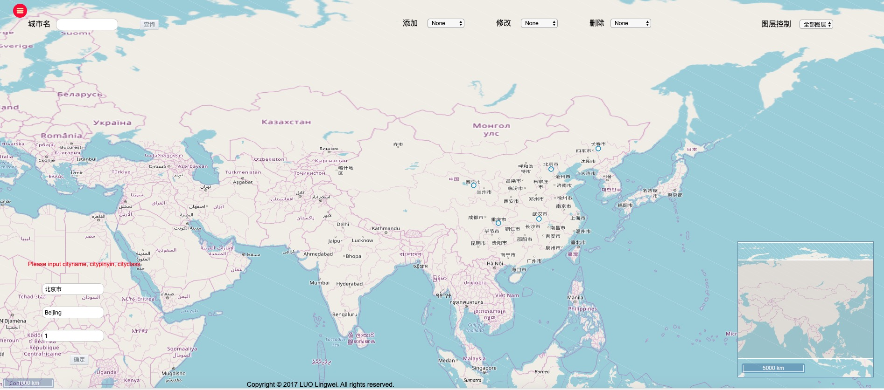

# Online Map Service
This is a WebGIS program developed by Lingwei Luo

Overview
---------
* Framework:  
  * Server: GeoServer  
  * Frontend Presentation: OSM + Openlayers3
  * Frontend Development: HTML + CSS + JavaScript + jQuery(ajax)
  * Backend Database: PostgreSQL 9.5 + PostGIS 2.3
  * Backend Development: C#(ASP.NET)  

* Supported Functions:  
  * user login
  * map query
  * map drag
  * map zoom
  * map rotation
  * map thumbnail
  * map statistics
  * distance measurement
  * POI addition
  * POI deletion
  * POI modification
  * map layer switching
  * map export

* Main page

